class: center, middle

# Neural Attention Mechanism in NLP

Oleksiy Syvokon

Dmitry Unkovsky

Grammarly


---

# Why?

.right[
>>> I am very excited by the recently introduced
>>> *attention models*, due to their simplicity and due to
>>> the fact that they work so well.
>>>
>>> — <cite>Ilya Sutskever, Research Director at OpenAI</cite>
]

???

Ilya is a Co-Founder and Research Director at OpenAI

--
1. Achieve state-of-the-art results on many NLP applications:

    * Neural translation
    * Text summarization
    * Text entailment
    * Text comprehension (question answering)
--

2. Practical, doesn't add huge number of parameters.
--

3. Easy to implement and grasp

--

4. Useful visualisations.


---
class: large


# Agenda

1. Sequence-to-sequence models 101

???

    - sequence-to-sequence models
    - sentence embeddings
    - encoder-decoder
    - state bottleneck problem

--

2. Attention mechanism in details

???

    - neural translation task
--

3. Attention advances and applications:

    - soft vs hard
    - local vs global
    - hierarchical
    - attention-over-attention
    - gated
    - ...

---
class: center, middle
# Part I: 
# Prerequisites
---

## Sequence-to-sequence models


???

Can feed variable length sequences as input
and get arbitrary length seqs on output.

--

- Machine translation:
```
the cat on the mat => кіт на килимку
```
--
- Image caption generation:  `=> cat on the mat`

--

- Sequence labeling:
```
the cat on the mat => DT NN IN DT NN
```

???

Determiner, Noun, Preposition, Determiner, Noun

--

- Classification:
```
the cat on the mat => CLASS_ANIMALS
```

---

# Encoder-decoder

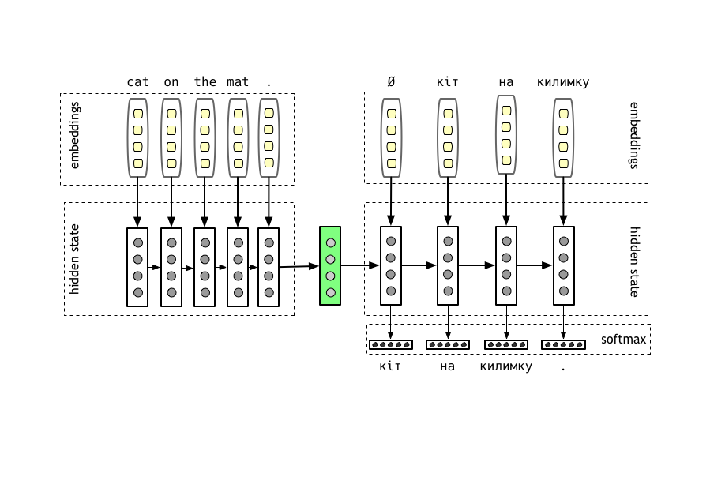

???

Read the source sentence one token a time. Often, token is a word,
but also can be a character or sub-word.

Compute the source sentence embedding from the sequence of hidden states
$h_1 ... h_n$.  In the simpliest case (which works reasonably well), just take
the last state,  $h_5$ in this example. Other options include convolving
over hidden states, or combining them in a recursive-tree manner.

What matters, is that in the end we have a single vector `h_6` that represents
(encodes) the whole sentence. This sentence embedding can be somewhat
similar to the familiar word embeddings. For example, sentences that have
similar meaning will likely have representations that are close to each other.

Having sentence embedding in hand, we can use it for bunch of tasks.
We can feed it into a classifier to get sentence category, like sentiment.
For a pair of sentences, we can concatenate the two states and again feed that
to a classifier, for example, to predict entailment relations.

For encoder-decoder architectures, we use that embedding to generate an
output sequence. We have another recurrent network (say, LSTM), that starts
with its state initialized by $h_6$. From that, it generates a new hidden
state, $h_7$, and predicts the first token by generating a softmaxed
distribution over the vocabulary. Let's say, we've picked the $argmax(y_7)$,
everything went well and the first word was "кіт" in our case, just as expected.

On the next step, we feed the predicted $y$ and the previous hidden state
$h_7$ to generate the probability distribution for the second word.
We continue until we see the end-of-sentence symbol.

That is a general intuition of how neural translation works. In practice,
of course, it is slightly more complicated. The architecture has several
layers. Normally, bi-directional LSTM are used, so that we encode source sentence
*twice*, the original and the reversed version, and the concatenate the two
state vectors. On the decoder stage, it is common to do a beam search
(with a relatively small beam size of 3 to 15) instead of a greedy search
that I've described. However, even the simple architecture will be able
to give more-or-less meaningful results.


---

# Encoder-decoder
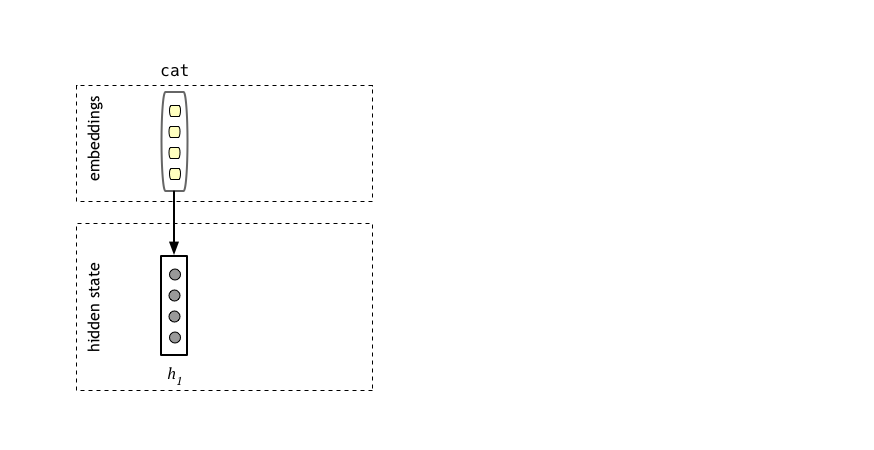

---
# Encoder-decoder
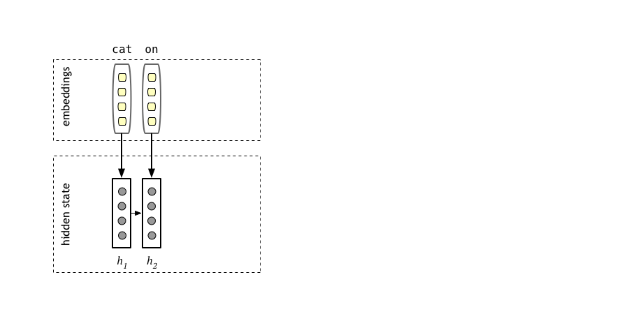
---

# Encoder-decoder

---

# Encoder-decoder

---

# Encoder-decoder
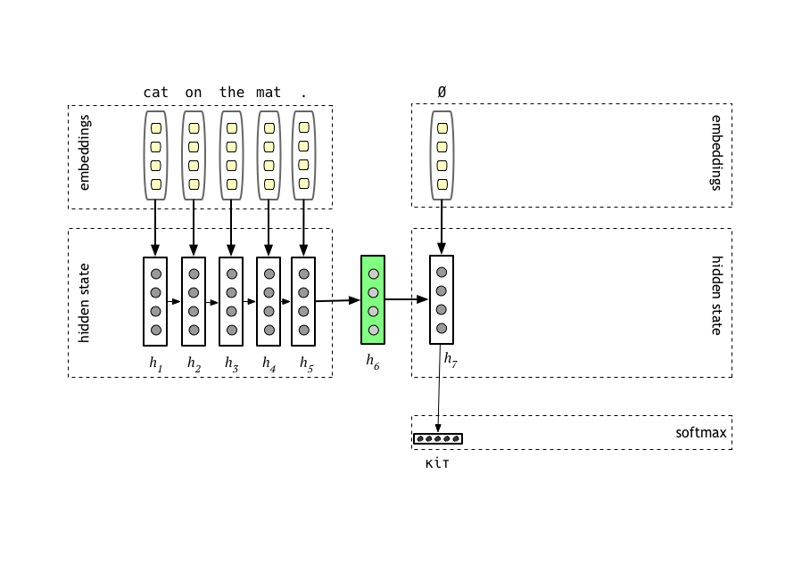
---

# Encoder-decoder
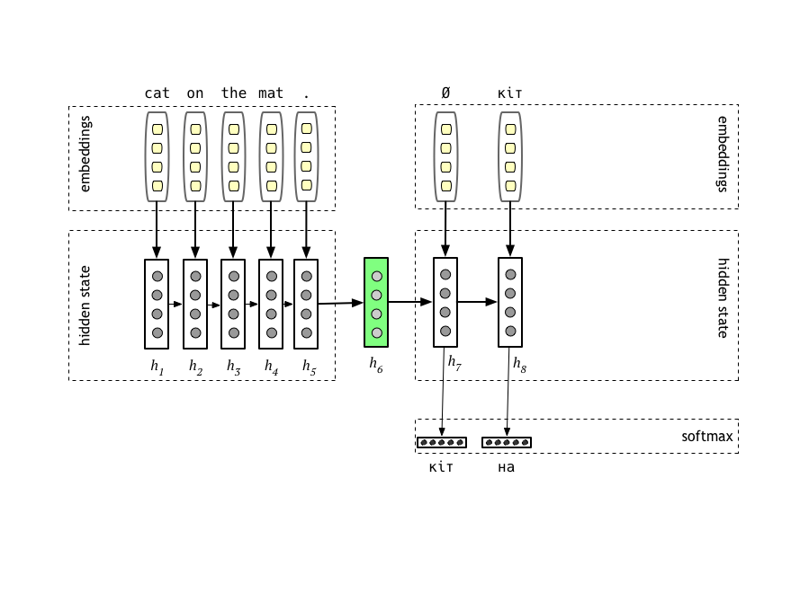
---

# Encoder-decoder

---

# Encoder-decoder: state bottleneck

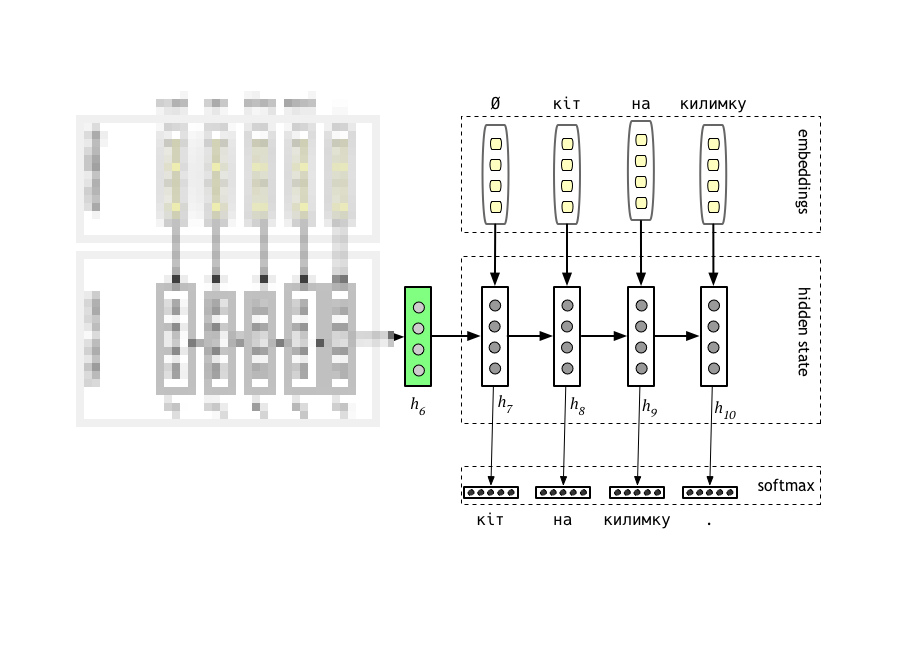

State bottleneck: 

???

The idea of representing the whole sentence meaning in a single fixed-sized
vector is very appealing, but it also means that the decoder must start
having only a fixed-sized vector at hand. Unfortunately, it doesn't work that
well with long sentences. Intuitively, when we try to cramp the long and/or
complicated sentence into a fixed-sized vector, we will inevitably loose
details that are important for tasks like translation.

---

# Content-based neural attention


.left-column30[]

.right-column70[
.medium[*Neural Machine Translation by Jointly Learning to Align and Translate*
([Bahdanau, 2014](https://arxiv.org/abs/1409.0473))]
]

???

* ICLR 2015 paper
* Graduated Belarusian State University
* 1215 citations so far (and counting) -- every paper about attention cites this.
* Started the attention boom
* Simple and effective techinique
* Dzmitry Bahdanau, Kyunghyun Cho, Yoshua Bengio.

--
* ICLR 2015 paper

--

* 1215 citations so far (and counting) -- every paper about attention cites this.

Started the attention boom in NLP!

---
class: center, middle
# Part II: 
# Attention, please!
---

# Attention intuition

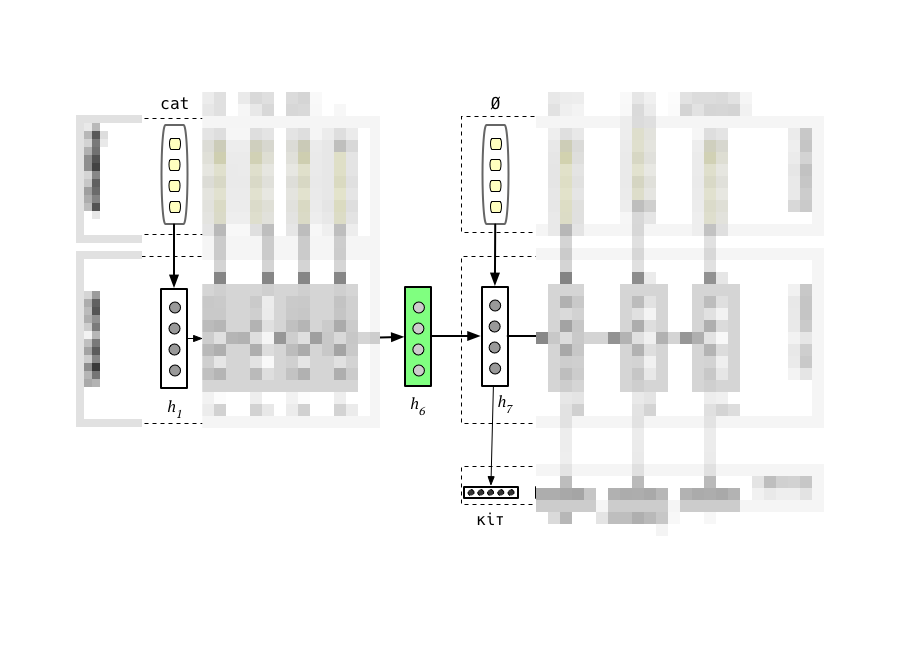

???

What we humans do when translating, is regularly look onto the source sentence
a couple words a time. We don't just read the source sentence once and then
throw it away. We keep it around and concentrate on relevant parts of it when
needed. That is the basic idea behind the attention mechanism: let's keep the
source hidden states pool and draw relevant parts of it on the decoder stage.

For example, when at the start of the sentence, I will look at the word "cat".

---

# Attention intuition

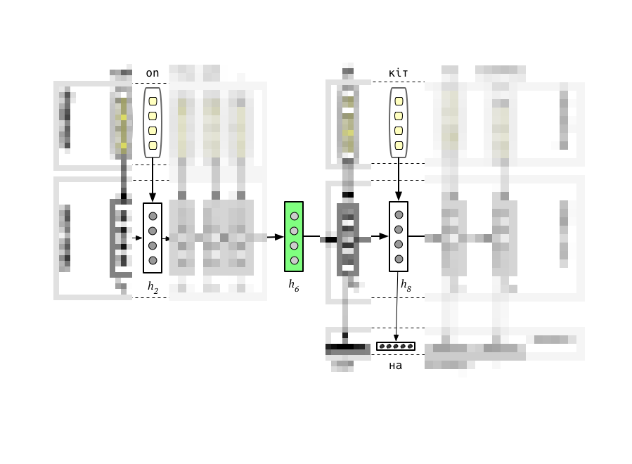

???

Then I move to the next word, and only interested in the second word (and maybe
also in some surrounding context as well as in the general context of what this
sentence is all about).

---

# Attention intuition

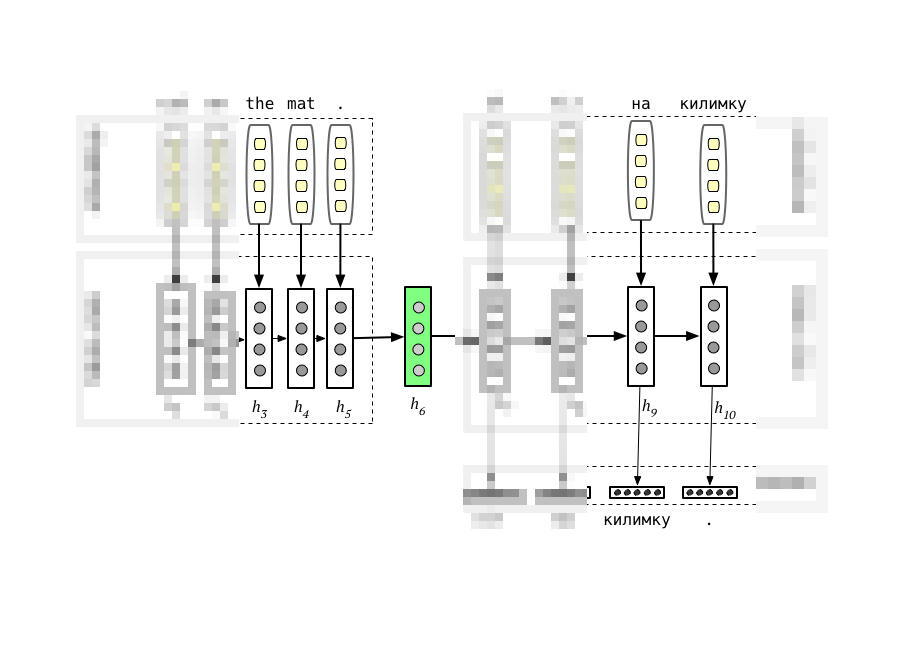

???

Finally, I get to the last part.

---

# Attention intuition


.right[.small[\* https://google.github.io/seq2seq/]]

---

# Attention intuition: words alignment

.right[.medium[*NMT by Jointly Learning to Align and Translate ([Bahdanau, 2014](https://arxiv.org/abs/1409.0473))*]]

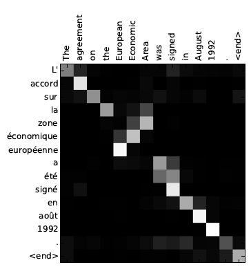


???

Turns out, machine translation has known this long before recurrent nets
revivals. They call it "words alignment", and it can be represented by
the alignment matrix. Previously, these alignments were computing by a
separate model. Attention mechanism is effectively implementation
of words alignment as a part of a single network. That should explain
the "Jointly Learning to Align and Translate" part of the Bahdanau's
paper.


---

## Encoder-decoder, no attention

.small[.left-column30[
1. Run RNN over the input:
<div>$$h_t = \text{RNN}(\text{embed}(x_t), h_{t-1})$$</div>

2.  Concatenate hidden state vectors into a matrix $H$:
  $$ H = \left[ \begin{array}{c} h_1 & h_2 & h_3 & ... & h_n \end{array} \right] $$
]]

.right-column70[.right[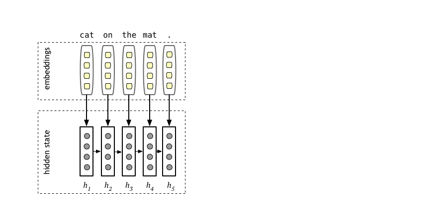]]

???

Okay, let's have a more formalized look at what we've just discussed.
We have an input sequence of words, $x_1 ... x_n$. We map this input into
embedding vectors. Then we we run recurrent neural, producing hidden states
$h_1 ... h_n$ along the way.

---

## Encoder-decoder, no attention

.small[.left-column30[
1. Run RNN over the input:
<div>$$h_t = \text{RNN}(\text{embed}(x_t), h_{t-1})$$</div>

2.  Concatenate hidden state vectors into a matrix $H$:
  $$ H = \left[ \begin{array}{c} h_1 & h_2 & h_3 & ... & h_n \end{array} \right] $$

3. Encode input sequence into a vector $c$:
  $$c = q(H)$$

  For example,
  $$c = h_n$$

]]

.right-column70[.right[]]

???

For the *non-attention* case, we then summary the whole source sentence into
a single vector $\mathbf{c}\$, commonly by just taking the last hidden state
and discarding all others.

---

## Encoder-decoder, no attention

.small[.left-column30[
1. Run RNN over the input:
<div>$$h_t = \text{RNN}(\text{embed}(x_t), h_{t-1})$$</div>

2.  Concatenate hidden state vectors into a matrix $H$:
  $$ H = \left[ \begin{array}{c} h_1 & h_2 & h_3 & ... & h_n \end{array} \right] $$

3. Encode input sequence into a vector $c$:
  $$c = q(H)$$

  For example,
  $$c = h_n$$

4. Predict the next output word:
<div>$$y_t = g(\text{embed}(y_{t-1}), h_{t-1}) $$</div>

<div>$$h_0^{(dest)} = c$$</div>

]]

.right-column70[.right[]]

???
We use that context vector to predict output sequence one word a time.

---

## Encoder-decoder, content-based attention

.small[.left-column30[
1. Run RNN over the input:
<div>$$h_t = \text{RNN}(\text{embed}(x_t), h_{t-1})$$</div>

2. Concatenate hidden state vectors into a matrix $H$:
  $$ H = \left[ \begin{array}{c} h_1 & h_2 & h_3 & ... & h_n \end{array} \right] $$

3. Generate new context vector for each output word:
<div>
  $$c_i = H \mathbf{\alpha}_t$$
</div>

4. Predict the next output word:
<div>$$y_t = g(\text{embed}(y_{t-1}), h_{t-1}, \color{red}{c_i})$$</div>

]]

.right-column70[.right[]]

???

Now, let's see what changes with the attention.

As before, we start by encoding the source sentence with RNN (often, with a
bi-directional RNN, but that doesn't really matter). This time we keep around
hidden state vectors corresponding to the input words. Let's concatenate them
in a matrix $H$.

Now comes the difference. Instead of computing sentence embedding (which is
also called a *context vector*) just once, we will do it again and again
for each of the output words. Decoder will be getting a context that is
specifically crafted for predicting each output.

What does this context vector look like? Well, it's just a weighted combination
of the input states ${h_1, h_2, ..., h_n}$:

<div>
  $$\mathbf{c}_i = H \mathbf{\alpha}_t$$
</div>


---

## Attention and context vectors

.left-column50[

Context vector $\mathbf{c}_i$ is a weighted sum over the source sentence:

<div>
$$\begin{aligned}

\mathbf{c}_i &= H \mathbf{\alpha}_t 
 \\
 &= \sum_{j=1}^n h_j \alpha_{ij}

\end{aligned}$$
</div>

Attention vector $\mathbf{\alpha_t}$ tells us how much should we focus on a
particular source word at a time step $t$:
]

.right-column50[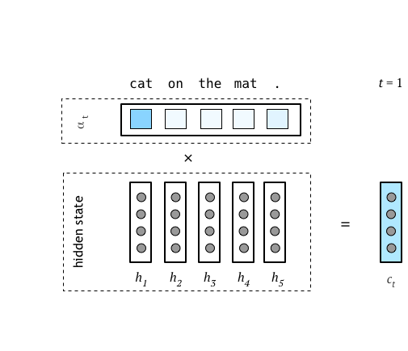]


---

## Attention and context vectors

.left-column50[

Context vector $\mathbf{c}_i$ is a weighted sum over the source sentence:

<div>
$$\begin{aligned}

\mathbf{c}_i &= H \mathbf{\alpha}_t 
 \\
 &= \sum_{j=1}^n h_j \alpha_{ij}

\end{aligned}$$
</div>

Attention vector $\mathbf{\alpha_t}$ tells us how much should we focus on a
particular source word at a time step $t$:
]

.right-column50[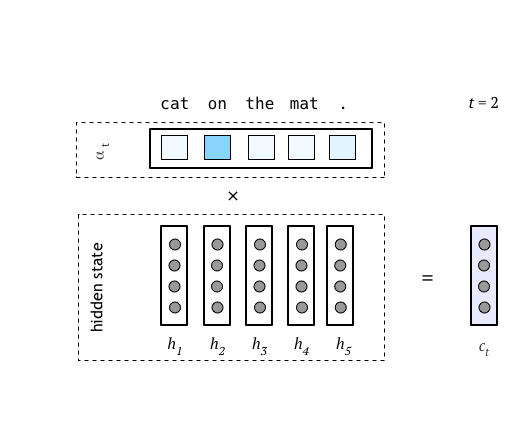]

---

## Attention and context vectors

.left-column50[

Context vector $\mathbf{c}_i$ is a weighted sum over the source sentence:

<div>
$$\begin{aligned}

\mathbf{c}_i &= H \mathbf{\alpha}_t 
 \\
 &= \sum_{j=1}^n h_j \alpha_{ij}

\end{aligned}$$
</div>

Attention vector $\mathbf{\alpha_t}$ tells us how much should we focus on a
particular source word at a time step $t$:
]

.right-column50[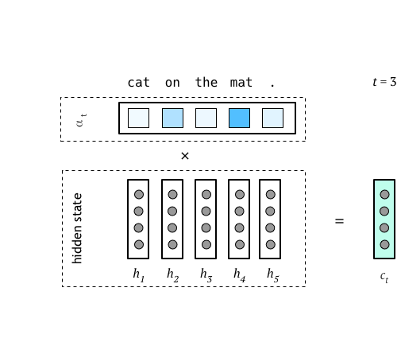]

---

## Attention step-by-step

.block[
* Encode the source sentence:
    <div>$$h_t = \text{RNN}(\text{embed}(x_t), h_{t-1}))$$</div>
]

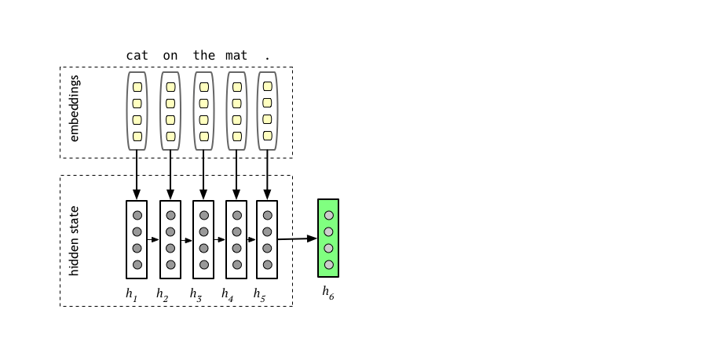

---

## Attention step-by-step

.block[
* Compute the first hidden state of the decoder:
   <div>$$h_7 = \text{RNN}([\text{embed}(\varnothing); c_0], h_6)$$</div>
]

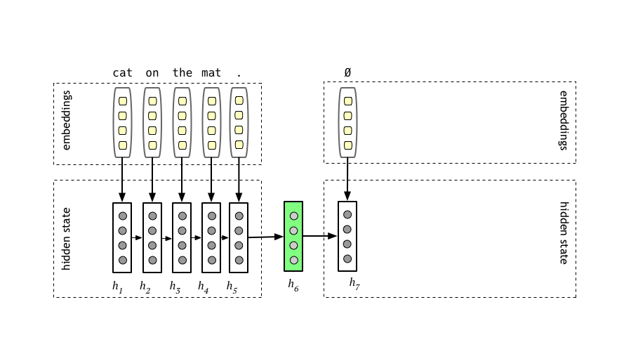

???

  - start-of-sentence token as a word input
  - null context vector
  - previous state taken to be the source sentence encoding

---

## Attention step-by-step

.block[
* Compute the attention vector:

   <div>$$\mathbf{\alpha}_{7} = \text{softmax}(\text{attention\_score}(H^{(src)}, h_7)) $$</div>
]

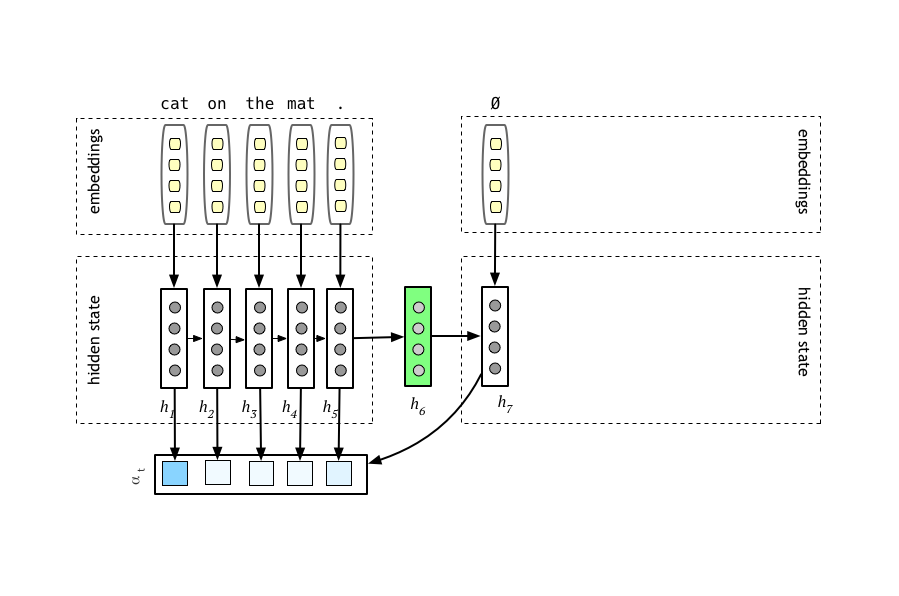

---

## Attention step-by-step

.block[
* Compute the context vector:

    <div>$$ \mathbf{c}_7 = H \mathbf{\alpha}_7 $$</div>
]

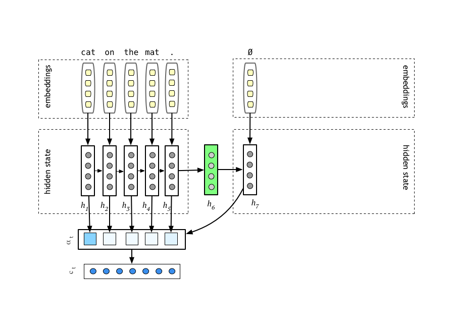

---

## Attention step-by-step

.block[
* Predict the first word:
    <div>$$y_7 = \text{softmax}(\text{embed}(\varnothing), h_6, c_7)$$</div>
]

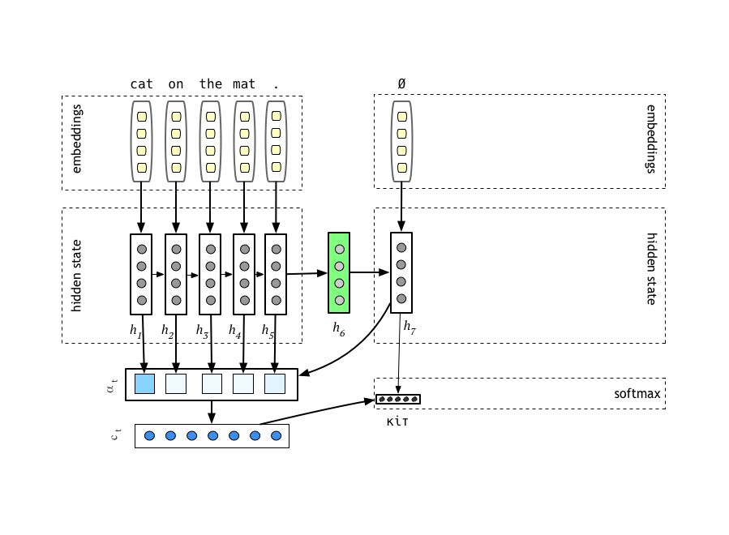

---

## Attention step-by-step

.block[
* Use that context vector and the predicted word to get next hidden state
   <div>$$h_8 = \text{RNN}([\text{embed}(y_7); c_7], h_7)$$</div>
]


---

## Attention step-by-step

.block[
* Repeat
]

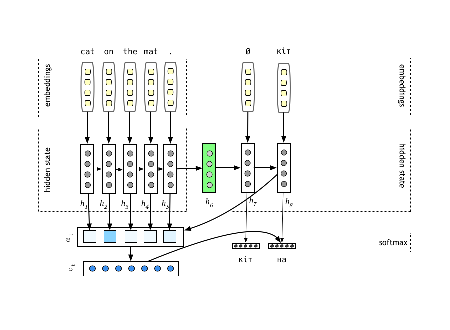

---

class: left

## How to compute attention


1. Compute the decoder's hidden state:

   <div>$$h_t^{(dest)} = \text{RNN}([\text{embed}(y_{t-1}); c_{t-1}], h_{t-1})$$</div>

--
2. Calculate an attention score $\mathbf{a}_t$:

   <div>$$\mathbf{a}_{t} = \text{attention\_score}(H^{(src)}, h_t^{(dest)}) $$</div>

--
3. Normalize that:

    <div>$$\mathbf{\alpha}_t = \text{softmax}(\mathbf{a}_t)$$</div>

--
4. Calculate context vector:

<div>
$$\begin{aligned}

\mathbf{c}_i &= H \mathbf{\alpha}_t 
 \\
 &= \sum_{j=1}^n h_j \alpha_{ij}

\end{aligned}$$
</div>

???

From where do we get this $\alpha_t$? 

Firstly, compute the decoder's hidden state $h\_t$ . Note, that we expand its
input to include the context vector $c_{t-1}$ from the previous step.

`attention_score` can be any function that takes two vectors as input
and outputs a score about how much we should focus on this particular
word encoding $h_j^{src}$. We will discuss this in more details in a second.

Finally, we normalize attention scores to get the properties we need:
it should sum to one and all its elements should be between 0 and 1.
This is what we need to get linear combination of the input hidden vectors.

---

## Ways to compute attention scores

### Dot product:

<div>$$ \text{attention\_score}(h_j^{(src)}, h_t^{(dest)}) = h_j^{(src)\intercal}  h_t^{(dest)} $$</div>

???

By now, we should have a solid intuition of what attention mechanism tries
to achieve. We also saw how it's used to calculate context vectors and how
we pass those into the decoder RNN. This remaining missing piece is how
to get the attention score.

The simplest option is to measure similarity between query and keys by taking
dot product (скалярний добуток) between two vectors. The advantage of this
model is that it adds no additional parameters. Disadvantage is that it's not
flexible, forcing input and output hidden states be in the same space.  In
order for dot product to be high, vectors must lay close to each other.

---

## Ways to compute attention scores

### Bilinear function:

<div>$$ \text{attention\_score}(h_j^{(src)}, h_t^{(dest)}) = h_j^{(src)\intercal} W_a  h_t^{(dest)} $$</div>

???
By performing a linear transform parametrized by $W_a$ we relax the
restriction that the source and target embeddings msut be in the same
space. If the $W_a$ is not square, source and destination hidden states can be
of different sizes, which is good.  On the other hand, it adds quite a few
parameters.

---

## Ways to compute attention scores

### Multi-layer perceptron:

<div>$$ \text{attention\_score}(h_j^{(src)}, h_t^{(dest)}) = w_{a2}^\intercal \tanh(W_{a1} [h_j^{(src)}; h_t^{(dest)}])$$</div>

???
Multi-layer perceptron was the method originally employed by Bahdanau.
This is more flexible that the dot product method, usually has fewer
parameters of the three, and generally provides good results.

W = (k, k)
H = (k, L)
M = tanh(W @ H) = (k, L)

w = (1, k)
alpha = softmax(w @ M) = (1, L)


---

## Ways to compute attention scores

### Advanced methods

* Recurrent NNs

* Tree-structured networks

* Convolutional NNs

* Structured models

...and more


???

RNN attention: very complicated, +3 BLUU for English-German

>>> Knowing which words have been attended to in previous time steps while generating a translation is a rich source of
information for predicting what words will be attended to in the future. We
improve upon the attention model of Bahdanau et al. (2014) by explicitly
modeling the relationship between previous and subsequent attention levels for
each word using one recurrent network per input word. This architecture easily
captures informative features, such as fertility and regularities in relative
distortion. In experiments, we show our parameterization of attention improves
translation quality.

---


## Google NMT

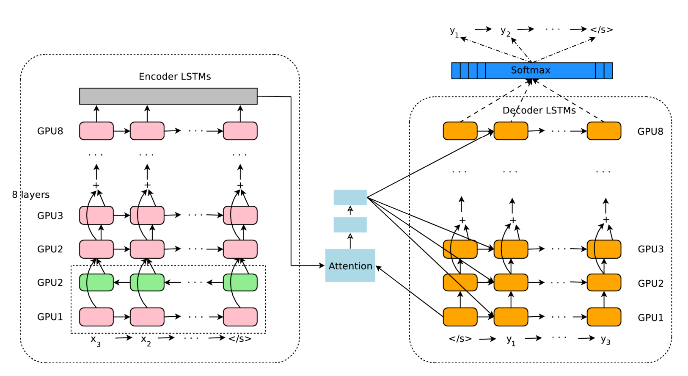

---

## Recap

1. What is the problem attention solves?

--

2. What is a context vector $c_i$?

--

3. What is attention vector $\alpha_t$?

--

4. How to compute attention vector?

---
class: center, middle
# Part III: 
# Advances and applications

---


## Image Caption Generation

.right[.medium[*Show, Attend and Tell: Neural Image Caption Generation with Visual Attention* ([Xu et al., 2016](https://arxiv.org/abs/1502.03044))]]

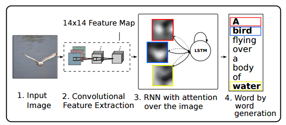

---

## Soft vs. Hard attention

.right[.medium[*Show, Attend and Tell: Neural Image Caption Generation with Visual Attention* ([Xu et al., 2016](https://arxiv.org/abs/1502.03044))]]

Soft: weighted sum of features.

Differentiable, but wasteful.

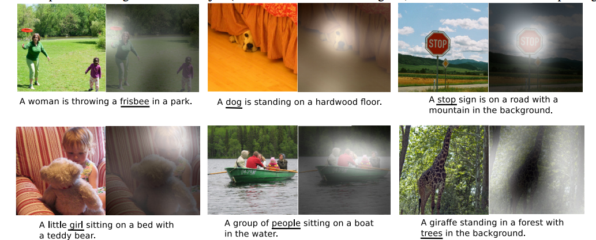

???

"Show, Attend and Tell" introduces two modes of attention.

Soft is just a weighted sum of features. It’s easy to compute because it’s
differentiable. At the same time, on each step we attend the whole input
sequence, so that's computationally expensive and comes against intuition
(humans don't do it that way).

---

## Soft vs. Hard attention

.right[.medium[*Show, Attend and Tell: Neural Image Caption Generation with Visual Attention* ([Xu et al., 2016](https://arxiv.org/abs/1502.03044))]]

Hard: take only one feature according to $\alpha$.

Non-differentiable, but faster on prediction time.

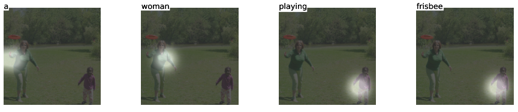

???

Hard attention means take only one feature according to alpha. Derivative is
zero almost everywhere, so cannot backpropagate and need to train with
methods like reinforcement learning -- much slower to train than with
backprop.

---
# Hierarchical Attention Networks

.right[.medium[*Hierarchical Attention Networks for Document Classification ([Yang, 2016](https://www.cs.cmu.edu/~diyiy/docs/naacl16.pdf)) *]]


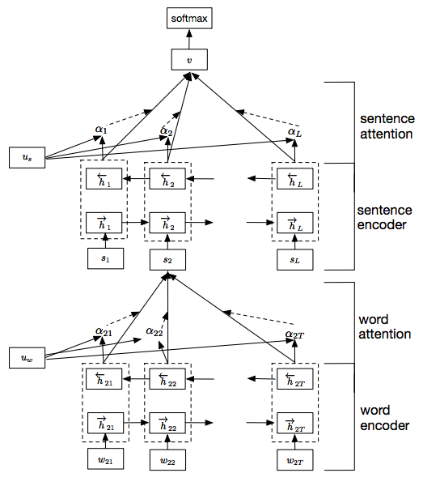

???
Hierarchical Attention Networks for Document Classification

---

# Hierarchical Attention Networks

.right[.medium[*Hierarchical Attention Networks for Document Classification ([Yang, 2016](https://www.cs.cmu.edu/~diyiy/docs/naacl16.pdf)) *]]

SOTA on document classification.


| Method            | Yelp'15 | IMDB |
| ----------------- | ------- | ---- |
| SVM + Features    | 62.4    | 40.5 |
| LSTM              | 58.2    | -    |
| LSTM-GRNN         | 67.6    | 45.3 |
| Hierarchical Ave  | 69.9    | 47.8 |
| Hierarchical ATT  | **71.0**  | **49.4** |

---

# Hierarchical Attention Networks

.right[.medium[*Hierarchical Attention Networks for Document Classification ([Yang, 2016](https://www.cs.cmu.edu/~diyiy/docs/naacl16.pdf)) *]]

Predicting YELP rating:

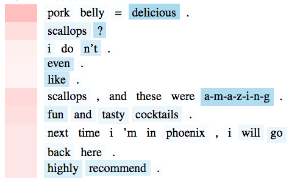


---
class: large

# Text entailment task

---
class: large

# Text entailment task

Given two sentences, the first called **premise**, and the second called
**hypothesis**, classify their relation either as an **entailment**,
**neutral**, or a **contradiction** 

---
class: large

# Text entailment task

Given two sentences, first called **premise**, and the second called
**hypothesis**, classify their relation either as an **entailment**,
**neutral**, or a **contradiction** 

Examples:

  * A man rides a bike on a snow covered road.
  * A man is outside.

or:

  * 2 female babies eating chips.
  * Two female babies are enjoying chips.

or:

  * A man in an apron shopping at a market.
  * A man in an apron is preparing dinner.

---
class: large

# Text entailment task

What would be your model to tell a proper class?

---
class: large

# Text entailment task

### Data: Stanford Natural Language Inference Corpus

https://nlp.stanford.edu/projects/snli/

~ 500k annotated sentence pairs

---

# Text entailment task

## Reminds of kaggle Quora Question Pairs task

Can you identify question pairs that have the same intent?

https://www.kaggle.com/c/quora-question-pairs/data

Examples:

 * What are the top 10 books one should read in his or her early 20s?
 * What books are worth reading in early 20s?

or

 * How do I read and find my YouTube comments?
 * How can I see all my Youtube comments?

or

 * Does society place too much importance on sports?
 * How do sports contribute to the society?

---
class: large

# Text entailment task

## Architecture

---

# Text entailment task

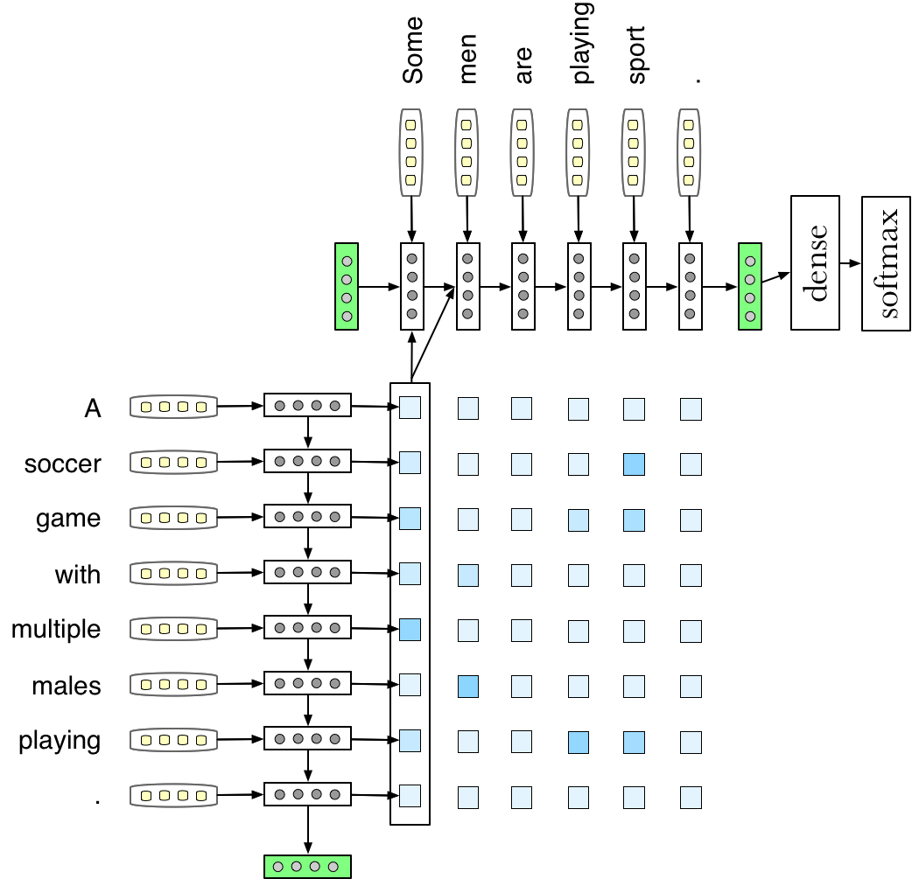

---

# Text entailment task

## Some examples

---

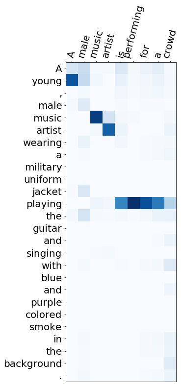

---

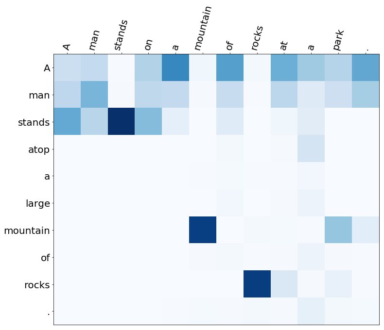

---

# Text entailment task

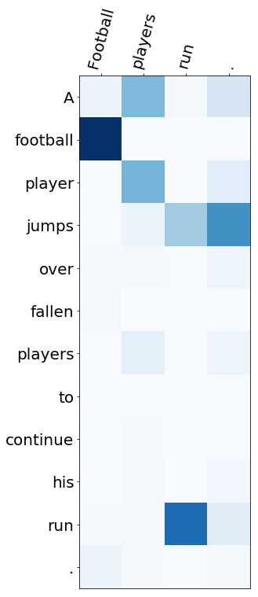

---
# Text entailment task

```
(438165,
 [('neutral', 0.059420608440525213),
  ('contradiction', 0.013449424957027407),
  ('entailment', 0.9271299666024474)],
 ('A football player jumps over fallen players to continue his run .',
  'Football players run .'),
 2)
```

---

# Text entailment task

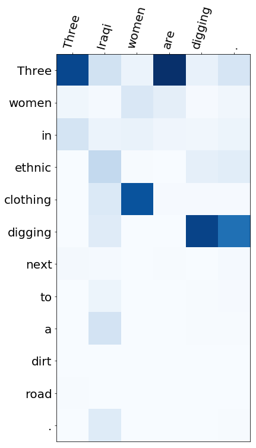

---

# Text entailment task

```
(453432,
 [('neutral', 0.78306303831501389),
  ('contradiction', 0.037344639411123676),
  ('entailment', 0.17959232227386249)],
 ('Three women in ethnic clothing digging next to a dirt road .',
  'Three Iraqi women are digging .'),
 0)
```

---

# Text entailment task

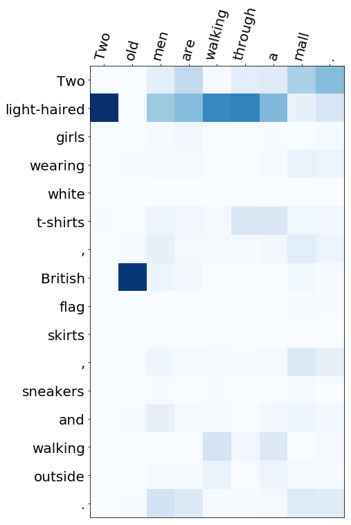

---

# Text entailment task

```
(47287,
 [('neutral', 0.9475953085514297),
  ('contradiction', 0.030916902870005147),
  ('entailment', 0.021487788578565356)],
 ('A woman poses awkwardly by a mural .',
  'A sad woman poses awkwardly by a mural .'),
 0)
```
 
---

# Text entailment task

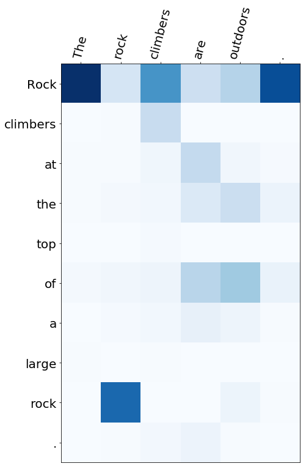

---

# Text entailment task

```
(40097,
 [('neutral', 0.065135302356665037),
  ('contradiction', 0.0057766436558386253),
  ('entailment', 0.92908805398749639)],
 ('Rock climbers at the top of a large rock .',
  'The rock climbers are outdoors .'),
 2)
```

---
class: large

# Tricks and tips

---
class: large

# Other tricks and tips

* **Normalize** your attention to 1 not only on columns, but on rows too

* **Fertility**: penalize overattended inputs, reward underattended

* **Symmetry**: Back and forth symmetry: F -> E are aligned symmetrical as E -> F

* ... lots of them! Read 1200-something papers on attention, and suit
  to your needs :-)


---
class: center, middle

# Thank you!

Oleksiy Syvokon

.small[http://github.com/asivokon]

Dmitry Unkovsky
.small[
 https://github.com/diunko
 https://facebook.com/dmitry.unkovsky
 ]

Grammarly


 https://www.facebook.com/AwesomelyG/

---

# References

1. Dzmitry Bahdanau, Kyunghyun Cho, and Yoshua Bengio. 2014. Neural machine
   translation by jointly learning to align and translate. *arXiv preprint
   arXiv:1409.0473.*

2. Neural Machine Translation and Sequence-to-sequence Models: A Tutorial. 2017.
   Graham Neubig.

3. Show, Attend and Tell: Neural Image Caption Generation with Visual Attention. 2016.
   Xu et al. 2016. *arXiv:1502.03044.*

4. Hierarchical Attention Networks for Document Classification. 2016.
   Zichao Yang, Diyi Yang, Chris Dyer, Xiaodong He, Alex Smola, Eduard Hovy

5. Effective Approaches to Attention-based Neural Machine Translation. 2015.
   Minh-Thang Luong, Hieu Pham, Christopher D. Manning.

6. Sequence to Sequence Learning with Neural Networks. 2014.
   Ilya Sutskever, Oriol Vinyals, Quoc V. Le
